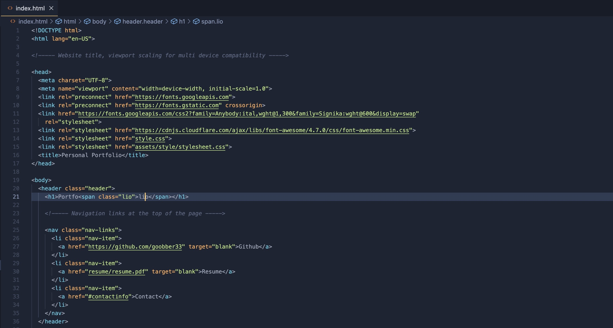
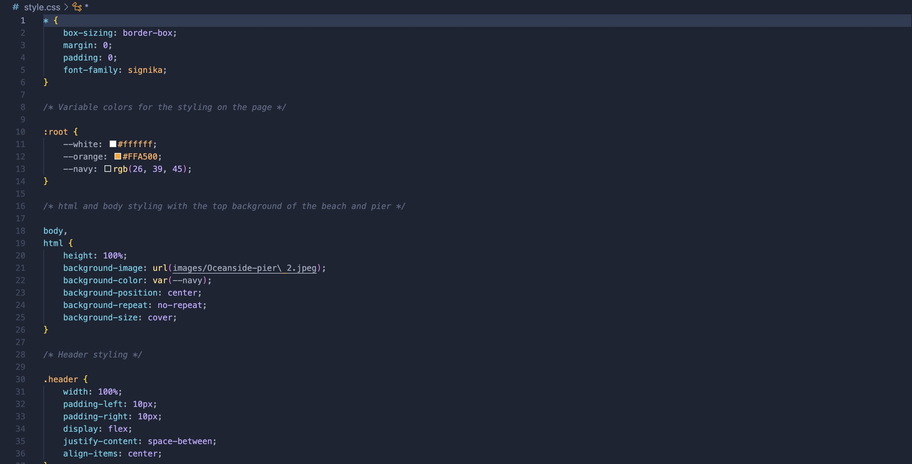
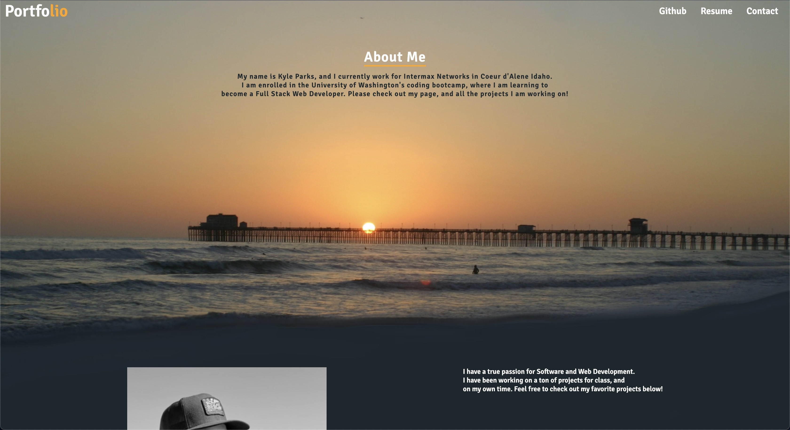
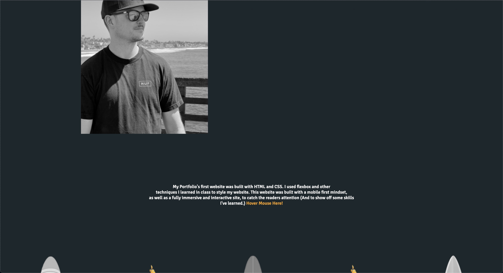
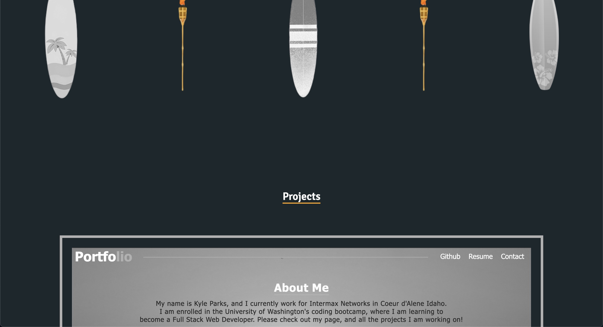
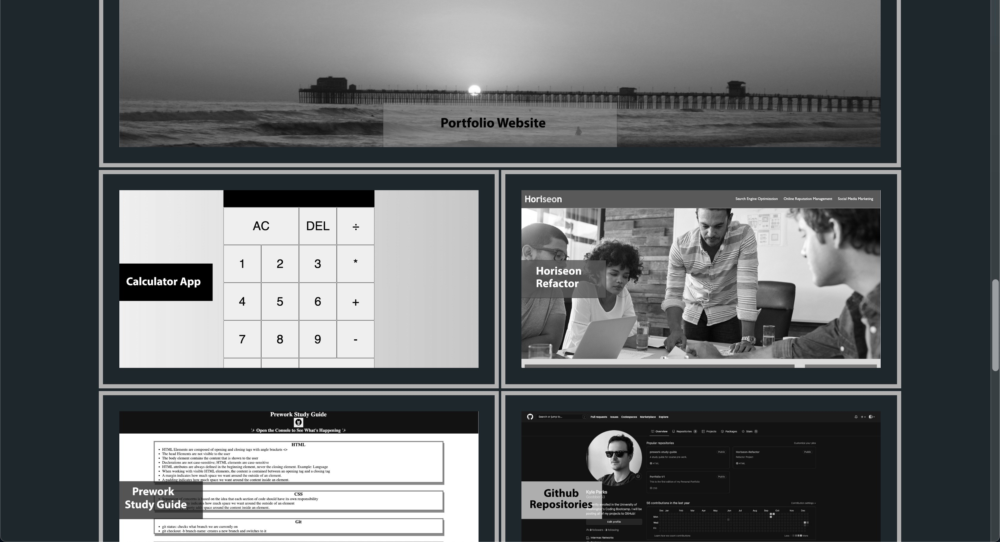
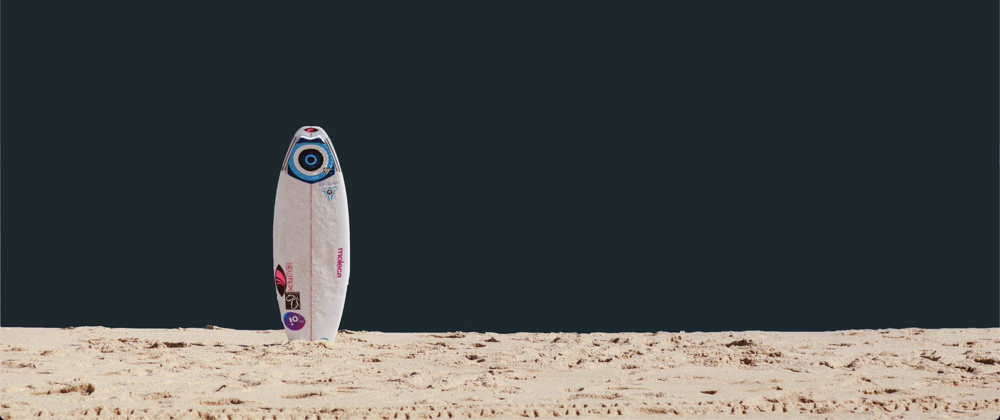
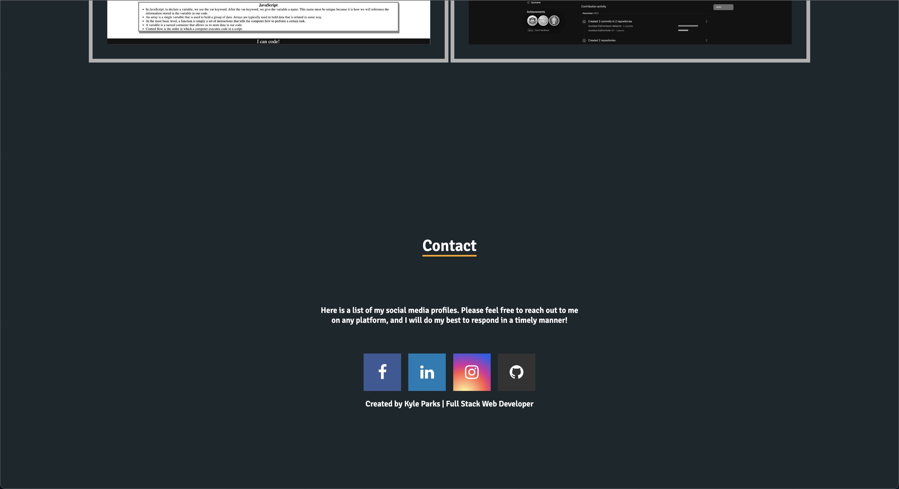

# Portfolio v1

 This is the first edition of my personal portfolio website. It was completely built from scratch, and it was an absolute blast utilizing the skills I have learned over the past month. Instead of using div tags, I named each section with section, aside, hero etc. I used flexbox to move things around on the page, and really got to understand how it works as well as grid. In the future, I will be adding JavaScript to this site, to make it more interactive. But for now, it was built with bare bone HTML and CSS!

# Website Link

https://goobber33.github.io/Portfolio-V1/

# Installation

Install the index.html, style.css, and stylesheet.css and the images folder and run it in your own IDE. 

# Usage

 A screenshot of some sections of code from my HTML and CSS for this project. 

Screenshots of the website. The website should resemble this screenshot when deployed.

# Credits

This project was built from scratch by Kyle Parks